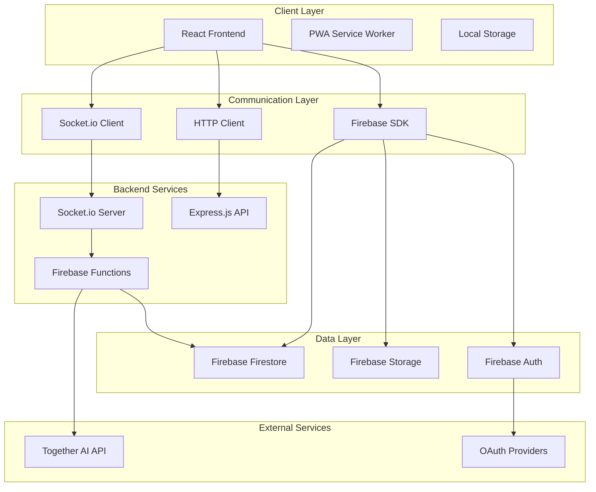
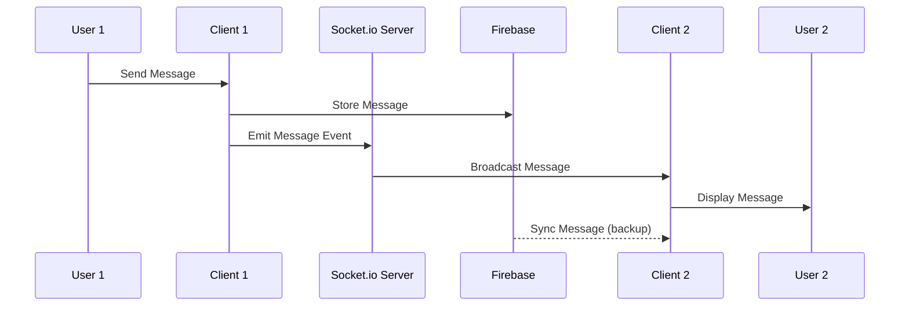

# Design Document

## Overview

ChatAI is architected as a modern, scalable real-time messaging application with integrated AI capabilities. The system follows a client-server architecture with Firebase as the backend-as-a-service provider and React as the frontend framework. The application leverages Socket.io for real-time communication, Firebase Firestore for data persistence, and Together AI's API for intelligent chatbot functionality.

The design emphasizes real-time performance, security, scalability, and user experience across desktop and mobile platforms. The architecture supports both traditional peer-to-peer messaging and AI-assisted conversations within a unified interface.

## Architecture

### High-Level Architecture



### Component Architecture

The frontend follows a modular component architecture with clear separation of concerns:

- **Presentation Layer**: React components with Material-UI and Tailwind CSS
- **State Management**: Zustand for global state, React hooks for local state
- **Business Logic**: Custom hooks and service layers
- **Data Access**: Firebase SDK and Socket.io client integration
- **Routing**: React Router for navigation and protected routes

### Real-time Communication Flow



## Components and Interfaces

### Frontend Components

#### Core Layout Components
- **AppLayout**: Main application shell with sidebar and chat area
- **Sidebar**: Chat list, contacts, and navigation
- **ChatArea**: Message display and input interface
- **Header**: User profile, settings, and search

#### Chat Components
- **ChatList**: Displays all user conversations with previews
- **MessageBubble**: Individual message display with metadata
- **MessageInput**: Text input with media attachment capabilities
- **TypingIndicator**: Shows when other users are typing
- **MessageReactions**: Emoji reactions and interaction controls

#### AI Integration Components
- **AIChat**: Dedicated AI conversation interface
- **AISettings**: AI personality and behavior configuration
- **AIIndicator**: Visual distinction for AI responses

#### Authentication Components
- **LoginForm**: Email/password and OAuth login
- **RegisterForm**: User registration with validation
- **ProfileSetup**: Initial profile configuration
- **PasswordReset**: Secure password recovery flow

### Backend Interfaces

#### Socket.io Event Handlers
```typescript
interface SocketEvents {
  // Connection events
  'user:connect': (userId: string) => void;
  'user:disconnect': (userId: string) => void;
  
  // Message events
  'message:send': (messageData: MessageData) => void;
  'message:receive': (messageData: MessageData) => void;
  'message:typing': (chatId: string, userId: string) => void;
  'message:read': (messageId: string, userId: string) => void;
  
  // Chat events
  'chat:join': (chatId: string) => void;
  'chat:leave': (chatId: string) => void;
  'chat:create': (chatData: ChatData) => void;
}
```

#### Firebase Cloud Functions
```typescript
interface CloudFunctions {
  // AI Integration
  processAIMessage: (message: string, context: ConversationContext) => Promise<AIResponse>;
  
  // User Management
  createUserProfile: (userData: UserData) => Promise<UserProfile>;
  updateUserStatus: (userId: string, status: UserStatus) => Promise<void>;
  
  // Chat Management
  createGroupChat: (groupData: GroupData) => Promise<ChatRoom>;
  addUserToChat: (chatId: string, userId: string) => Promise<void>;
  
  // Media Processing
  processMediaUpload: (file: File, metadata: MediaMetadata) => Promise<MediaUrl>;
}
```

### API Interfaces

#### Together AI Integration
```typescript
interface TogetherAIService {
  sendMessage(prompt: string, context: ConversationContext): Promise<AIResponse>;
  streamResponse(prompt: string, context: ConversationContext): AsyncGenerator<string>;
  getAvailableModels(): Promise<AIModel[]>;
  setPersonality(personality: AIPersonality): void;
}
```

#### Firebase Service Interfaces
```typescript
interface FirebaseService {
  // Authentication
  signIn(email: string, password: string): Promise<User>;
  signUp(userData: UserRegistration): Promise<User>;
  signOut(): Promise<void>;
  
  // Firestore Operations
  createMessage(messageData: MessageData): Promise<string>;
  getMessages(chatId: string, limit?: number): Promise<Message[]>;
  subscribeToMessages(chatId: string, callback: (messages: Message[]) => void): () => void;
  
  // Storage Operations
  uploadFile(file: File, path: string): Promise<string>;
  deleteFile(path: string): Promise<void>;
}
```

## Data Models

### User Model
```typescript
interface User {
  uid: string;
  email: string;
  displayName: string;
  photoURL?: string;
  bio?: string;
  status: 'online' | 'away' | 'busy' | 'offline';
  lastSeen: Timestamp;
  createdAt: Timestamp;
  settings: UserSettings;
}

interface UserSettings {
  theme: 'light' | 'dark';
  notifications: boolean;
  privacy: PrivacySettings;
  aiPreferences: AIPreferences;
}
```

### Chat Model
```typescript
interface Chat {
  chatId: string;
  type: 'private' | 'group' | 'ai';
  participants: string[];
  lastMessage?: LastMessage;
  createdAt: Timestamp;
  updatedAt: Timestamp;
  groupInfo?: GroupInfo;
  unreadCount: number;
}

interface GroupInfo {
  name: string;
  description?: string;
  admin: string;
  photoURL?: string;
  settings: GroupSettings;
}
```

### Message Model
```typescript
interface Message {
  messageId: string;
  chatId: string;
  sender: string;
  content: MessageContent;
  timestamp: Timestamp;
  readBy: Record<string, Timestamp>;
  edited: boolean;
  editedAt?: Timestamp;
  replyTo?: string;
  reactions: Record<string, string[]>; // emoji -> userIds
  type: 'user' | 'ai' | 'system';
}

interface MessageContent {
  text?: string;
  media?: MediaContent;
  file?: FileContent;
}

interface MediaContent {
  type: 'image' | 'video' | 'audio';
  url: string;
  thumbnail?: string;
  duration?: number;
  dimensions?: { width: number; height: number };
}
```

### AI Conversation Model
```typescript
interface AIConversation {
  conversationId: string;
  userId: string;
  context: ConversationContext;
  personality: AIPersonality;
  createdAt: Timestamp;
  lastInteraction: Timestamp;
}

interface ConversationContext {
  messages: ContextMessage[];
  topic?: string;
  preferences: AIPreferences;
}
```

## Error Handling

### Frontend Error Handling Strategy

#### Error Boundaries
- **Global Error Boundary**: Catches unhandled React errors
- **Route Error Boundaries**: Handles navigation and route-specific errors
- **Component Error Boundaries**: Isolates component-level failures

#### Error Types and Handling
```typescript
enum ErrorType {
  NETWORK_ERROR = 'NETWORK_ERROR',
  AUTHENTICATION_ERROR = 'AUTHENTICATION_ERROR',
  PERMISSION_ERROR = 'PERMISSION_ERROR',
  VALIDATION_ERROR = 'VALIDATION_ERROR',
  AI_SERVICE_ERROR = 'AI_SERVICE_ERROR',
  STORAGE_ERROR = 'STORAGE_ERROR'
}

interface ErrorHandler {
  handleError(error: AppError): void;
  showUserFriendlyMessage(errorType: ErrorType): void;
  logError(error: Error, context: ErrorContext): void;
  retryOperation(operation: () => Promise<any>, maxRetries: number): Promise<any>;
}
```

### Backend Error Handling

#### Firebase Functions Error Handling
- **Structured Error Responses**: Consistent error format across all functions
- **Retry Logic**: Automatic retry for transient failures
- **Circuit Breaker**: Prevent cascade failures in AI API calls
- **Graceful Degradation**: Fallback mechanisms for service unavailability

#### Socket.io Error Handling
```typescript
interface SocketErrorHandler {
  handleConnectionError(error: Error): void;
  handleMessageDeliveryError(messageId: string, error: Error): void;
  handleRoomError(roomId: string, error: Error): void;
  reconnectWithBackoff(): void;
}
```

### AI Service Error Handling
- **API Rate Limiting**: Handle Together AI rate limits gracefully
- **Fallback Responses**: Provide helpful messages when AI is unavailable
- **Context Recovery**: Maintain conversation context during service interruptions
- **Cost Management**: Monitor and limit AI API usage per user

## Testing Strategy

### Frontend Testing

#### Unit Testing
- **Component Testing**: React Testing Library for component behavior
- **Hook Testing**: Custom hooks with React Hooks Testing Library
- **Utility Testing**: Pure functions and helper utilities
- **State Management**: Zustand store testing

#### Integration Testing
- **API Integration**: Mock Firebase and Socket.io services
- **Route Testing**: React Router navigation and protected routes
- **Form Testing**: User input validation and submission flows
- **Real-time Features**: Socket.io event handling and state updates

#### End-to-End Testing
- **User Flows**: Complete user journeys from registration to messaging
- **Cross-browser Testing**: Chrome, Firefox, Safari, Edge compatibility
- **Mobile Testing**: Responsive design and touch interactions
- **Performance Testing**: Load times and real-time message delivery

### Backend Testing

#### Firebase Functions Testing
```typescript
interface FunctionTest {
  testAIMessageProcessing(): Promise<void>;
  testUserAuthentication(): Promise<void>;
  testMessageStorage(): Promise<void>;
  testMediaUpload(): Promise<void>;
}
```

#### Socket.io Testing
- **Connection Testing**: User connect/disconnect scenarios
- **Message Broadcasting**: Real-time message delivery verification
- **Room Management**: Chat room join/leave functionality
- **Error Scenarios**: Network interruption and reconnection testing

#### AI Integration Testing
- **API Response Testing**: Together AI API integration and response handling
- **Context Management**: Conversation context preservation and retrieval
- **Error Handling**: AI service unavailability and rate limiting
- **Performance Testing**: Response time and throughput measurement

### Security Testing
- **Authentication Testing**: JWT token validation and expiration
- **Authorization Testing**: User permissions and access control
- **Input Validation**: XSS and injection attack prevention
- **File Upload Security**: Malicious file detection and sanitization
- **Rate Limiting**: API abuse prevention and throttling

### Performance Testing
- **Load Testing**: Concurrent user simulation and system capacity
- **Stress Testing**: System behavior under extreme conditions
- **Message Throughput**: Real-time message delivery performance
- **Media Handling**: File upload/download speed and optimization
- **Database Performance**: Firestore query optimization and indexing

This design provides a comprehensive foundation for building the ChatAI application with proper separation of concerns, scalable architecture, robust error handling, and thorough testing strategies. The modular approach ensures maintainability and allows for incremental development and feature additions.

Note: Dont add any test files to the project in any situation if added then delete it after it serves it pupose.